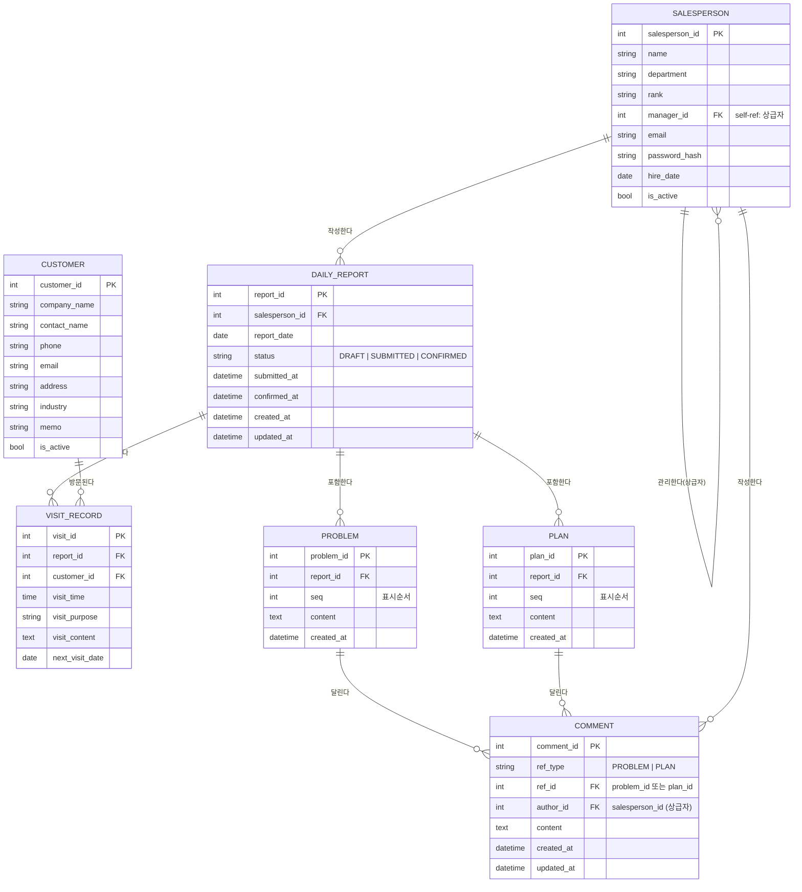

# 영업 일일보고 시스템 요구사항 정의 및 ER 다이어그램

| 항목 | 내용 |
|---|---|
| 문서명 | 영업 일일보고 시스템 요구사항 정의 및 ER 다이어그램 |
| 버전 | v1.0 |
| 작성일 | 2026-05-14 |

---

## 1. 시스템 개요

영업사원이 매일의 고객 방문 활동, 현안 과제/상담, 익일 계획을 보고하고, 상급자가 이를 확인·피드백하는 웹 기반 영업 일일보고 시스템

---

## 2. 기능 요구사항 (Functional Requirements)

### FR-01. 마스터 관리

| ID | 요구사항 |
|---|---|
| FR-01-1 | 영업사원 마스터를 등록·수정·삭제·조회할 수 있다 |
| FR-01-2 | 영업사원은 사원명, 부서, 직급, 상급자 정보를 가진다 |
| FR-01-3 | 고객 마스터를 등록·수정·삭제·조회할 수 있다 |
| FR-01-4 | 고객은 회사명, 담당자명, 연락처, 주소, 업종 정보를 가진다 |

### FR-02. 일일보고 작성

| ID | 요구사항 |
|---|---|
| FR-02-1 | 영업사원은 하루에 1건의 일일보고를 작성한다 (보고일자+사원 기준 유일) |
| FR-02-2 | 일일보고는 방문기록, 과제/상담(Problem), 익일계획(Plan) 섹션으로 구성된다 |
| FR-02-3 | 보고 상태는 임시저장 → 제출 → 확인 으로 관리된다 |

### FR-03. 방문기록

| ID | 요구사항 |
|---|---|
| FR-03-1 | 하루에 방문한 고객을 여러 행(Row) 추가할 수 있다 |
| FR-03-2 | 각 행에는 고객, 방문시간, 방문목적, 방문내용, 차기방문예정일을 입력한다 |
| FR-03-3 | 고객은 고객 마스터에서 선택한다 |

### FR-04. 과제/상담 (Problem)

| ID | 요구사항 |
|---|---|
| FR-04-1 | 현재 처리 중인 과제, 상담 내용을 여러 건 작성할 수 있다 |
| FR-04-2 | 상급자는 각 Problem 항목에 댓글로 의견을 남길 수 있다 |
| FR-04-3 | 댓글은 여러 건 작성 가능하며 작성자와 작성일시가 기록된다 |

### FR-05. 익일계획 (Plan)

| ID | 요구사항 |
|---|---|
| FR-05-1 | 내일 할 일을 여러 건 작성할 수 있다 |
| FR-05-2 | 상급자는 각 Plan 항목에 댓글로 의견을 남길 수 있다 |
| FR-05-3 | 댓글은 여러 건 작성 가능하며 작성자와 작성일시가 기록된다 |

### FR-06. 조회 및 관리

| ID | 요구사항 |
|---|---|
| FR-06-1 | 상급자는 부하 직원의 일일보고 목록을 날짜/사원 기준으로 조회할 수 있다 |
| FR-06-2 | 일일보고 목록은 보고일자, 사원명, 제출상태를 표시한다 |
| FR-06-3 | 본인의 과거 보고 이력을 조회할 수 있다 |

---

## 3. 비기능 요구사항

| 분류 | 요구사항 |
|---|---|
| 보안 | 로그인한 사용자만 보고서 접근 가능, 타인의 보고서 수정 불가 |
| 권한 | 상급자만 댓글 작성 가능, 본인 보고서만 작성/수정 가능 |
| 데이터 | 보고일자+사원ID 기준 일일보고 중복 생성 불가 |
| 감사 | 모든 생성/수정에 작성일시, 수정일시 기록 |

---

## 4. 엔티티 정의

| 엔티티 | 설명 |
|---|---|
| SALESPERSON | 영업사원 마스터 |
| CUSTOMER | 고객 마스터 |
| DAILY_REPORT | 일일보고 헤더 (1사원 1일 1건) |
| VISIT_RECORD | 방문기록 (일일보고당 N건) |
| PROBLEM | 과제/상담 항목 (일일보고당 N건) |
| PLAN | 익일계획 항목 (일일보고당 N건) |
| COMMENT | 댓글 (Problem/Plan 각각에 N건) |

---

## 5. ER 다이어그램

---

## 6. 주요 제약 조건

| 제약 | 내용 |
|---|---|
| UK | `DAILY_REPORT(salesperson_id, report_date)` — 1사원 1일 1보고 |
| FK | `SALESPERSON.manager_id → SALESPERSON.salesperson_id` (자기참조) |
| CHECK | `DAILY_REPORT.status IN ('DRAFT','SUBMITTED','CONFIRMED')` |
| CHECK | `COMMENT.ref_type IN ('PROBLEM','PLAN')` |
| 업무규칙 | SUBMITTED 이후 영업사원 본인은 수정 불가 |
| 업무규칙 | COMMENT 작성자는 상급자(`manager_id`로 관계 확인) 권한 필요 |
